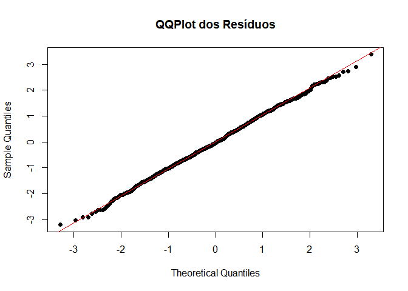

# MultiRegR

O objetivo do pacote **MultiRegR** é fornecer uma interface amigável
para ajuste de modelos de regressão linear múltipla e geração de
gráficos de diagnóstico. Ele permite aos usuários ajustar modelos
utilizando uma estimação customizada dos coeficientes, visualizar os
valores ajustados versus observados, avaliar os resíduos por meio de
QQPlots, histogramas e gráficos ACF, além de realizar predições em novos
dados. O pacote é ideal para pesquisadores e praticantes que precisam de
uma ferramenta eficiente e customizável para análise de regressão linear
no R.

## Instalação

Você pode instalar a versão de desenvolvimento do **MultiRegR**
diretamente do GitHub usando o pacote `devtools`:

``` r
# Instale o pacote devtools, se ainda não o tiver
install.packages("devtools")

# Instale o MultiRegR a partir do GitHub
devtools::install_github("https://github.com/udinh0/MultiRegR")
```

## Exemplo de Uso

Abaixo está um exemplo básico mostrando como ajustar um modelo de
regressão linear múltipla e gerar gráficos de diagnóstico:

### Ajuste do Modelo de Regressão

Primeiro, crie um conjunto de dados de exemplo e ajuste um modelo de
regressão linear múltipla usando a função RegLin():

``` r
library(MultiRegR)

# Ajustar o modelo de regressão linear múltipla
modelo = RegLin(y ~ x1 + x2, data = exampleData)

# Ver os coeficientes estimados
modelo
```

    ## Call:
    ## RegLin(formula = y ~ x1 + x2, data = exampleData)
    ## 
    ## Coeficientes:
    ##                Estimate Std. Error    t-value   p-value
    ## Intercepto  0.010398273 0.10173402  0.1022104 0.9186102
    ## x1         -0.018020518 0.01636494 -1.1011661 0.2710902
    ## x2          0.002887958 0.01626230  0.1775861 0.8590841
    ## 
    ## R2: 0.001247 
    ## R2 Ajustado: -0.0007566

### Geração de Gráficos de Diagnóstico

Uma vez ajustado o modelo, você pode visualizar diversos gráficos de
diagnóstico para avaliar o ajuste do modelo, incluindo os valores
ajustados vs. observados, um QQPlot dos resíduos, um histograma dos
resíduos e a ACF dos resíduos.

``` r
plot(modelo)
```

<!-- --><!-- --><!-- --><!-- -->

### Fazer Predições em Novos Dados

Você também pode usar o modelo ajustado para predizer valores de novos
dados com a função predict_reglin():

``` r
# Gerar novos dados para predição
novos_dados = data.frame(
  x1 = rnorm(5, 0, 1),
  x2 = rnorm(5, 10, 2)
)

# Fazer a predição dos novos valores
predicoes = predict_reglin(modelo, novos_dados)
print(predicoes)
```

    ##            [,1]
    ## [1,] 0.05844496
    ## [2,] 0.03912540
    ## [3,] 0.02437675
    ## [4,] 0.01563628
    ## [5,] 0.01814152

## Problemas ou melhorias

Se você encontrar algum problema ou tiver sugestões de melhorias,
sinta-se à vontade para abrir uma issue no repositório do GitHub.
